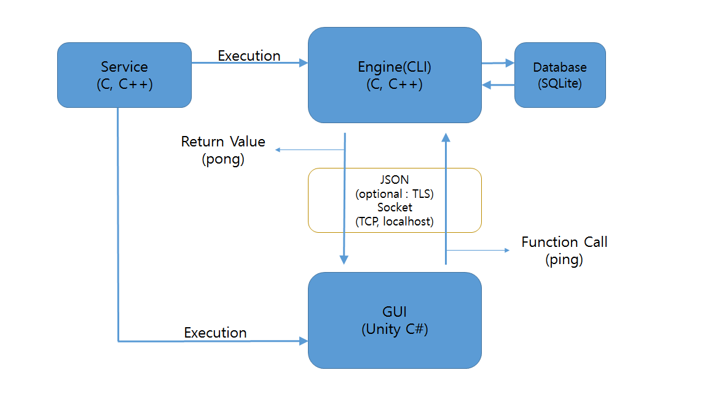

# Requirement Specification: Overview

TWTL Doc 005

TWTL 시스템의 시스템의 목적, 기능, 구현 방식 등에 대해 포괄적으로 다룹니다. IEEE 830 권고 SRS의 Section 1, Section 2에 대응하는 내용을 기술합니다.

## 본 문서에 대하여
시스템 아키텍쳐는 시스템의 목적과 이용자 요구사항 등을 기초로 하는 전체적인 시스템 골격을 의미합니다. 다양한 기술이 여러가지 형태로 결합되기에, 혼란을 방지하고 본래 목적의 방향성을 잃지 않기 위해 가장 먼저 정하는 것이 일반적입니다.

따라서 이 문서는 TWTL 시스템이 갖추어야 할 기능적, 비기능적 사항등을 정의하는 수단으로, 시스템의 서비스 및 기능을 정의하고, 서비스/기능영역의 경계와 참여주체를 정의하고 표현할 것입니다. 일반적으로 같이 고려되는 사업계획, 사업범위 설정 및 통합 틀은 여기에서는 제외되었습니다.

## Structure

## Goal
TWTL의 목적은 크게 두가지로 볼 수 있습니다.

1. System Monitering : 현재의 System Register 및 등록된 Service를 캡처하여 저장합니다. 이상이 발생했을때, 가장 최근 또는 정상 작동 되었던 시점과 다른 점을 비교하여 사용자에게 전달합니다.

2. Network Monitering : 불량 사이트에 접속하려는 패킷을 차단하고, 이를 사용자에게 전달합니다. 또한 프로세스가 접속하는 패킷의 정보를 주기적으로 기록하여 문제 발생시에 이용할 수 있도록 합니다.   

## functional
TWTL이 갖는 기능을 설명합니다.

### Universal
위 목적을 위한 작업을 수행하는 주체를 엔진(Engine)이라 부르며, 엔진은 다음과 같은 기능을 갖습니다.

1. Auto Start : 부팅과 함께 자동 실행

2. Crash Checking : 오류가 났을 경우 정상적인 실행을 위한 동작 유도

### Database(DB)
캡처된 Register , Service 및 Packet을 데이터베이스에 저장합니다. 데이터베이스는 다음과 같은 기능을 갖습니다.

1. Abstraction : 엔진에서 sqlite3를 이용한 DB 접근 추상화 계층 구현

2. Accessibility : 이 Database는 엔진을 통해서만  접근할 수 있음

### Engine-System
System Monitering을 위한 엔진은 다음과 같은 기능을 갖습니다.

1. Watching ( HIPS )  : 행동기반 ( Maybe API Hooking )

2. Capture : COM / Register 

3. Logging : 최근 1주일 간의 변경사항 저장

4. Comparing : 지금과 가장 최근의 또는 이상이 없었던 시점과의 변경사항 비교

5. Modification : 프로세스 종료, Registry Value 삭제

6. Logging : Database에 Snapshot 저장

### Engine-Network
Network Monitering을 위한 엔진은 다음과 같은 기능을 갖습니다.

1. Watching : winpcap으로 시스템의 모든 패킷 캡처 및 저장 

2. Blocking : 구글 멀웨어 블랙리스트 IP에 접속하는 프로세스 패킷 차단

3. Logging : 프로세스가 어디에 접속하는지 주기적으로 DB에 저장.(저장내용 : 프로세스 이름, 경로, 접속 주소 (IP, DNS), 접속 포트, IP의 악성 여부)

### User Interface(UI)
사용자에게 직접적으로 보여지는 User Interface 는 다음과 같은 기능을 갖습니다. 

1. Connecting : 엔진과 연결 시도, 유지, 실패시 유저에게 알림.

2. Showing : 메인 화면에서 네트워크 / 레지스트리 / 서비스 세 가지 부분에 변경점이 생겼는지 한 눈에 간단하게 보여주기. 일부 기능은 실시간으로 업데이트

3. Request(Compare) : 스냅샷 비교 호출. UI 최초 구동 시점에 한 번, 유저가 원하는 시점에도 가능

4. Request(Delete & Blocking) : 유저가 원할 경우 변경 부분을 삭제, 차단하는 기능을 엔진 쪽에 요청 

5. Alarm : 실시간으로 차단된 사항에 대하여 사용자에게 알림

## nonfunctional
TWTL이 가지지 않을 기능을 설명합니다.

- Disk IO
- CPU Usage
- Network Usage 
 
위 기능들은 정당하게 사용하는 프로그램과 구분이 힘들고, 구현하기 위한 비용이 매우 크므로 고려하지 않을 것입니다.

## 작업환경

- Engine : C/C++

- UI : Unity

## 맺으며

맺는 말은 없습니다.
